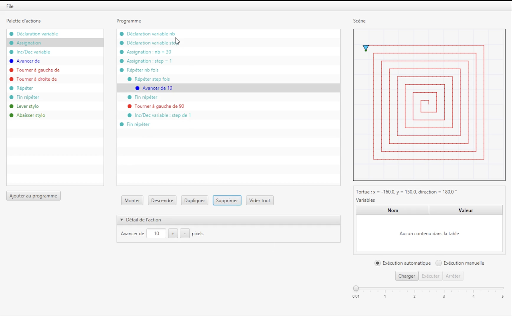

# Scratch — ANC 2526 (groupe C06)

Éditeur graphique de type **Scratch / Logo** développé dans le cadre du cours **ANC** (Analyse et Conception) à l’EPFC.

L’utilisateur compose un **programme** à partir de blocs d’actions (avancer, tourner, boucles, variables, formes…), puis l’exécute pour dessiner sur une scène 2D.

## Aperçu



---

## Équipe

| Membre |
|--------|
| Hugo |
| Sam Prophete Nsengimana |
| Zié Alassane Traoré |

Groupe **C06** — année académique **2025–2026**.

---

## Stack technique

| Élément | Technologie |
|---------|-------------|
| Langage | **Java** 25 |
| Build | **Maven** |
| UI | **JavaFX** 21 + ControlsFX |
| Architecture | **MVVM** (`model` / `view` / `viewmodel`) |
| Affichage | `Canvas` JavaFX |
| Persistance | Import / export de programmes (fichiers texte) |

---

## Fonctionnalités

### Actions de base
- Avancer (`MOVE_FORWARD`)
- Tourner à gauche / à droite
- Stylet levé / baissé (`PEN_UP` / `PEN_DOWN`)

### Contrôle de flux
- Boucle `REPEAT` / `END_REPEAT`
- Variables : déclaration, affectation, incrémentation

### Dessin avancé
- Polygone
- Rectangle
- Croix
- Téléportation (déplacement sans tracer)

### Interface
- Palette d’actions
- Liste ordonnée du programme
- Panneau de détail / paramètres
- Scène de rendu en temps réel
- Sauvegarde et chargement de programmes

---

## Structure du dépôt

```
anc_2526_c06/
├── pom.xml
├── docs/                          # Diagrammes UML + captures d’écran
│   ├── screenshots/
│   │   └── scratch-ui.png
│   ├── diagramme de class final.puml
│   └── …
└── src/main/java/
    ├── module-info.java
    └── scratch/
        ├── App.java               # Point d’entrée JavaFX
        ├── model/                 # Actions, Programme, exécution, I/O
        ├── view/                  # MainView, Palette, Scene, Program…
        └── viewmodel/             # Liaison UI ↔ modèle
```

---

## Conception

Choix principaux retenus au fil des itérations :

- Séparation stricte **model / view / viewmodel**
- Types d’actions centralisés dans l’enum `ActionType`
- Classe abstraite `Action` + paramètres via `ActionParameter`
- Exécution pilotée par un `ExecutionContext` (position, orientation, stylet, variables)
- Canvas dédié pour le rendu de la scène
- Diagrammes de classes versionnés dans `docs/`

Les programmes sont des listes d’actions sérialisées (type + paramètres). `ProgramFileService` gère l’import / export.

---

## Remarques

Projet pédagogique d’analyse et conception orientée objet. Les diagrammes PlantUML dans `docs/` retracent l’évolution du modèle au fil des itérations.
